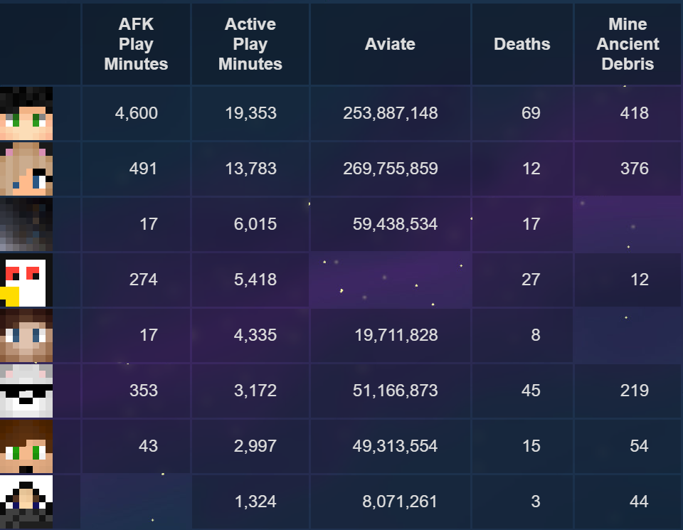

# WebStats
WebStats is a spigot plugin that can gather player statistics from multiple
sources and display it on a webpage. It can get data from the **scoreboard**,
from any plugin that stores its data in a **database**, from **PlaceholderAPI**
and player **online/AFK** status. It can also be used as a **Discord webhook**.

[View demo page here](https://dantevg.nl/mods-plugins/WebStats/demo)

## [Getting started](https://github.com/Dantevg/WebStats/wiki/Getting-Started)
To use WebStats, you need:
- A Spigot Minecraft server
- (optional) A web server (note: the plugin will not work over https, so make sure the
  webpage isn't served over https either)

See [the wiki](https://github.com/Dantevg/WebStats/wiki/Getting-Started) for installation instructions.

## Plugin config file
<!-- don't remove/rename this heading because it was linked to by config.yml until v1.6 -->
For information about the config file, head over to the [wiki page](https://github.com/Dantevg/WebStats/wiki/Config-file).

## Contributing
If you want to help make WebStats more awesome, you can do so by reporting
a bug, suggesting a feature or helping with documentation. Anything is welcome!

If you like to write something yourself, pull requests are also open. Starting
from version 1.8, WebStats uses maven to build, so it should be very easy to
work on the code yourself.

### Contributors
Thank you to these people for helping out with the plugin by suggesting features and reporting bugs!
- [@Dancull47](https://github.com/Dancull47):
  MySQL feature suggestion ([#2](https://github.com/Dantevg/WebStats/issues/2))
- [@draexo (spigotmc)](https://www.spigotmc.org/members/draexo.2905/):
  bug report ([spigotmc #13](https://www.spigotmc.org/threads/web-stats.492833/#post-4308888)),
  Discord feature suggestion ([#13](https://github.com/Dantevg/WebStats/issues/13))
- [@LcorpOfficial](https://github.com/LcorpOfficial):
  colour codes feature suggestion ([#33](https://github.com/Dantevg/WebStats/issues/33)),
  bug report ([#32](https://github.com/Dantevg/WebStats/issues/32))
- [@Mr_Coco](https://github.com/coco0325):
  top-100 and performance improvements suggestion ([#12](https://github.com/Dantevg/WebStats/issues/12)),
  HTTPS reverse proxy idea ([#12](https://github.com/Dantevg/WebStats/issues/12)),
  bug report ([#14](https://github.com/Dantevg/WebStats/issues/14))
- [@Nick Messer](https://github.com/NickMesser):
  bug report ([#50](https://github.com/Dantevg/WebStats/issues/50))
- [@Unkn0wn3636 (spigotmc)](https://www.spigotmc.org/members/unkn0wn3636.1457887/):
  multiple tables suggestion ([#26](https://github.com/Dantevg/WebStats/issues/26)),
  separate server entry suggestion ([#27](https://github.com/Dantevg/WebStats/issues/27)),
  bug report ([#30](https://github.com/Dantevg/WebStats/issues/30))
- [@valenvaio](https://github.com/valenvaio):
  bug report ([#16](https://github.com/Dantevg/WebStats/issues/16))
- [@zeus1921](https://github.com/zeus1921):
  PlaceholderAPI feature suggestion ([#3](https://github.com/Dantevg/WebStats/issues/3)),
  online player filter suggestion ([#6](https://github.com/Dantevg/WebStats/issues/6)),
  column ordering suggestion ([#7](https://github.com/Dantevg/WebStats/issues/7)),
  placeholder storer suggestion ([#8](https://github.com/Dantevg/WebStats/issues/8)),
  bug reports ([#5 (comment)](https://github.com/Dantevg/WebStats/issues/5#issuecomment-902033169))

[1]: https://github.com/Dantevg/WebStats/releases
